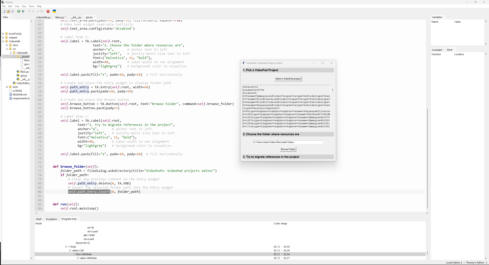

# VideoPath

VideoPath è una semplice utility per migrare con facilità i riferimenti alle risorse, memorizzati nei progetti del software VideoPad Video Editor, da un percorso a un altro.

# Il problema

VideoPad Video Editor, o VideoPad Professional, è un'applicazione Windows per l'editing del video digitale con un'interfaccia pulita e facile da utilizzare ma con potenti funzioni di montaggio.
Tuttavia, una volta che un progetto è stato creato, e che quindi sono stati stabiliti i percorsi nel file system delle risorse cui il progetto fa riferimento, cambiare la posizione di tali risorse è problematico.

Nei progetti di VideoPad Video Editor, i percorsi delle risorse linkate sono memorizzati come percorsi assoluti. 
Pertanto, anche se si sposta tutta la cartella contenente sia il progetto sia le risorse, all'avvio il progetto - dal momento che i percorsi assoluti sono cambiati - non troverà le risorse e quindi non potrà caricarle.
Ciò genererà una serie di errori, che verranno mostrati in un'apposita maschera.

***Figura 1. Maschera per l'aggiornamento dei percorsi delle risorse non trovate. Notare dalla grandezza della scrollbar, sulla destra, quanti sono i files mancanti***

Agendo sui pulsanti della maschera (bottoni "Risolvi") è possibile aggiornare il percorso di ogni risorsa ma, soprattutto nei progetti che fanno riferimento a molte risorse (files audio, musica, immagini, spezzoni video etc.), ricaricare ogni singola risorsa nel progetto risulta veramente scocciante.
Non è possibile, infatti, specificare solo il percorso ma bisogna puntare alla risorsa specifica e ricaricarla; inoltre, in caso di svista, il software non segnala il problema.

***Work in progress***