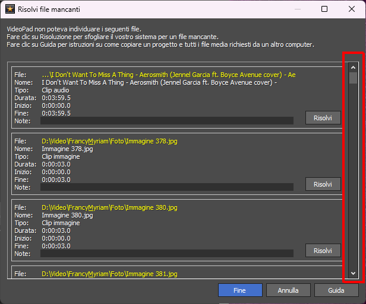

# VideoPath

VideoPath è una semplice utility per migrare con facilità i riferimenti alle risorse, memorizzati nei progetti del software VideoPad Video Editor, da un percorso a un altro.

# Il problema

VideoPad Video Editor, o VideoPad Professional, &egrave; un'applicazione Windows per l'editing del video digitale con un'interfaccia pulita e facile da utilizzare ma con potenti funzioni di montaggio.

***Figure 1. Un esempio di come appare l'interfaccia principale di VideoPad***

Tuttavia, una volta che un progetto &egrave; stato creato, e che quindi sono stati stabiliti i percorsi nel file system delle risorse cui il progetto fa riferimento, cambiare la posizione di tali risorse &egrave; laborioso.

Nei progetti di VideoPad Video Editor, i percorsi delle risorse linkate sono memorizzati come percorsi assoluti. 
Pertanto, anche se si sposta tutta la cartella contenente sia il progetto sia le risorse, all'avvio il progetto - dal momento che i percorsi assoluti sono cambiati - non trover&agrave; le risorse e quindi non potr&agrave; caricarle.
Ci&ograve; generer&agrave; una serie di errori, che verranno mostrati in un'apposita maschera.

***Figura 2. Maschera per l'aggiornamento dei percorsi delle risorse non trovate. Notare, da quanto &egrave; piccola la scrollbar sulla destra, quanti devono essere in questo progetto i files non trovati...***

Agendo sui pulsanti della maschera (bottoni "Risolvi") &egrave; possibile aggiornare il percorso di ogni risorsa ma, soprattutto nei progetti che fanno riferimento a molte risorse (files audio, musica, immagini, spezzoni video etc.), ricaricare ogni singola risorsa nel progetto risulta veramente scocciante.
Non &egrave; possibile, infatti, specificare solo il percorso ma bisogna puntare alla risorsa specifica e ricaricarla; inoltre, in caso di svista, il software non segnala il problema.

&Egrave; anche disponibile un tool di migrazione, ma questo non sposterà il progetto da un percorso all'altro mantenendo i percorsi relativi delle risorse ma appiattirà tutto, file di progetto e files linkati, in un'unica directory.

Non era questo che volevo: io desideravo poter spostare i progetti riposizionandoli in altre cartelle ma mantenendo le posizioni relative delle risorse rispetto al progetto. Ho perciò pensato di sviluppare un'utility che facesse questo.

***Work in progress***

## La soluzione

## Esempi