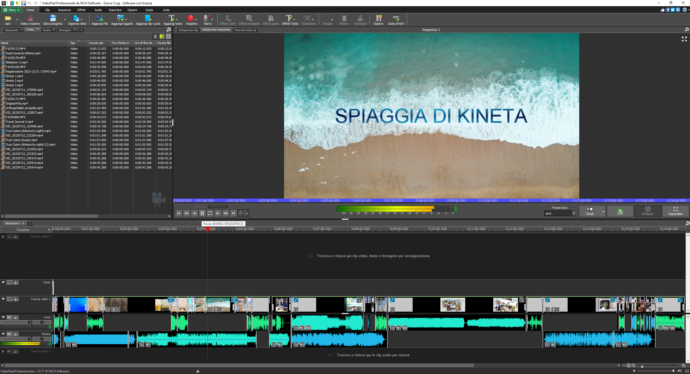
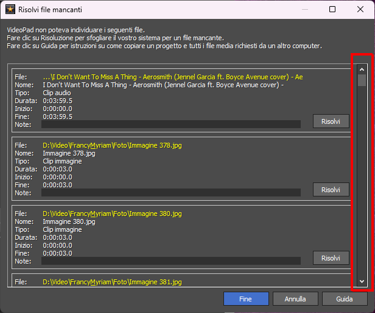
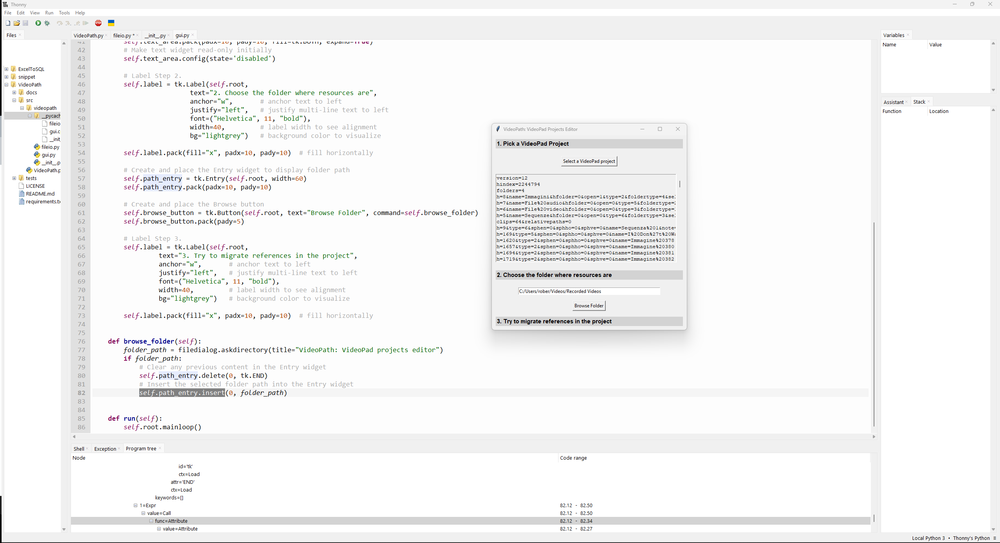

# VideoPath

VideoPad is a nice and simply editor, with powerful features, but when you move the files linked into a project, is very annoying to reload every single file into the project itself!

This is a simple utility to migrate the VideoPad Video Editor projects from a path to another one.

# The problem

Let's start from beginning!  
VideoPad Video Editor - also known as VideoPad Professional - is a Windows application for digital video editing.

***Figure 1. An example of how the main interface of VideoPad looks like***

In VideoPad projects, the paths of linked resources are stored as absolute paths. 

Therefore, whether you move just the linked resources or move the entire folder containing both the project and the resources, when you start the project, it will not be able to find the resources and thus will not be able to load them, since the absolute paths have changed.
This will generate a series of errors, which will be displayed in a special window.

***Figure 2. Mask for updating paths of resources not found. Imagine, seeing the small size of the scrollbar on the right, how many files must be missing.***

By clicking on the buttons on the screen corresponding to each missing resource, you can update the path for each resource. 
However, especially in projects that refer to many resources (audio files, music, images, video clips, etc.), reloading every single resource in the project can be really boring!

In fact, it is not possible to specify the only path: you must point to the every specific missing resource, and reload it.

Furthermore, in case of mistake, the software does not report the problem: it simply points a resource that doesn't match, and skip the new reference.

***It is work in progress***